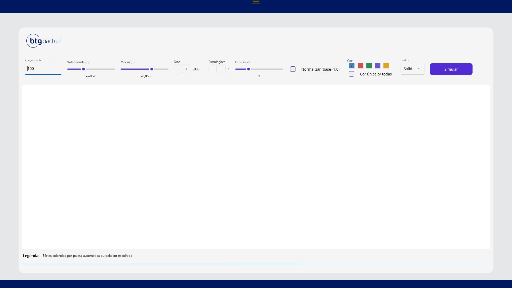
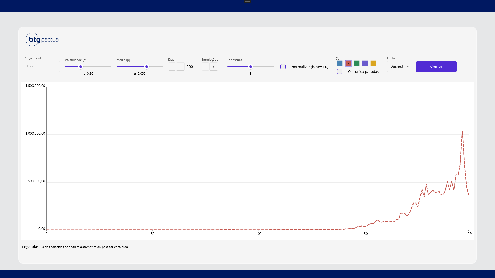
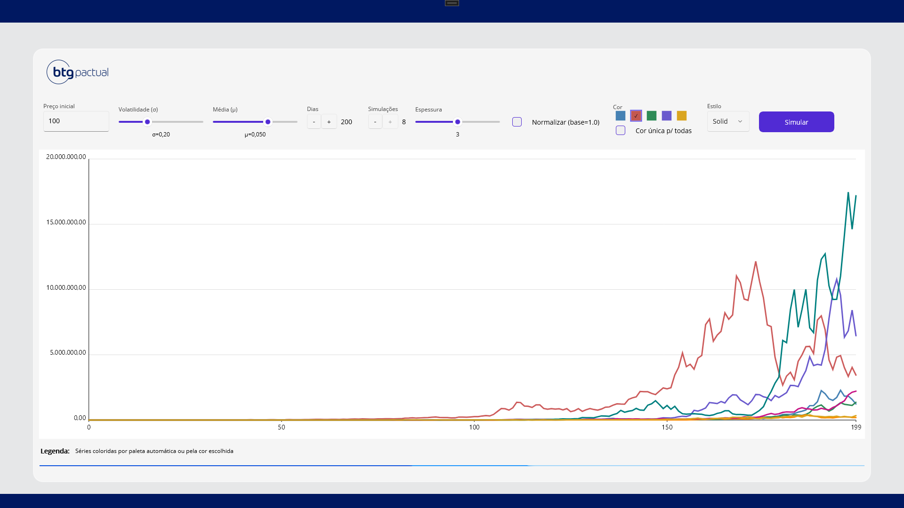

# 📊 FinanceApp

Aplicativo em .NET MAUI para simulação de séries financeiras usando Movimento Browniano Geométrico.
O projeto tem fins didáticos, explorando conceitos de MVVM, SkiaSharp para renderização de gráficos, e boas práticas de organização de código.

## 🚀 Funcionalidades

Simulação de séries de preços baseada em processo estocástico (Browniano).

Personalização visual dos gráficos:

Escolha de cores;

Diferentes estilos de linha (sólida, tracejada, pontilhada);

Ajuste da espessura da linha.

Opção de normalizar os dados (base = 1.0).

Interface responsiva e ajustada com FlexLayout.

## 🛠️ Tecnologias Utilizadas

.NET 9

.NET MAUI

SkiaSharp
 (renderização de gráficos)

MVVM (padronização da UI)

## Telas

## Como executar
1. Clone o repositório
2. Restaure os pacotes (`dotnet restore`)
3. Rode o projeto (`dotnet build` e `dotnet run` ou F5 no Visual Studio)
